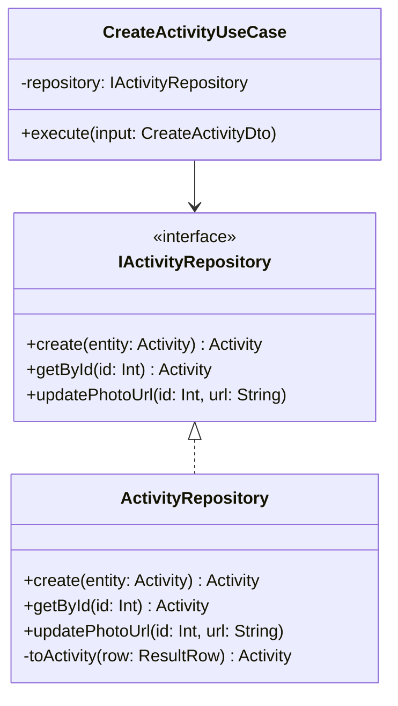
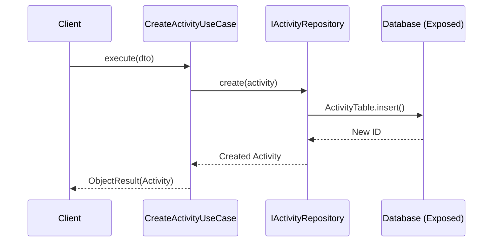
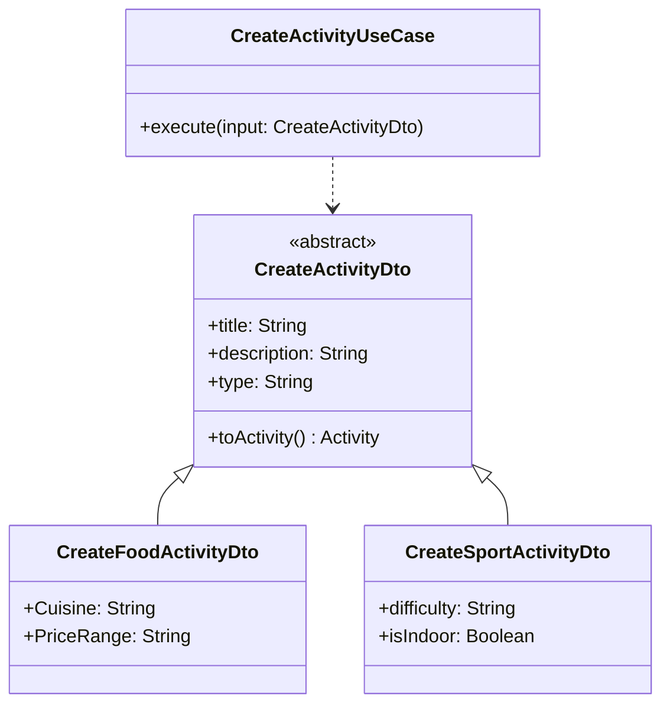
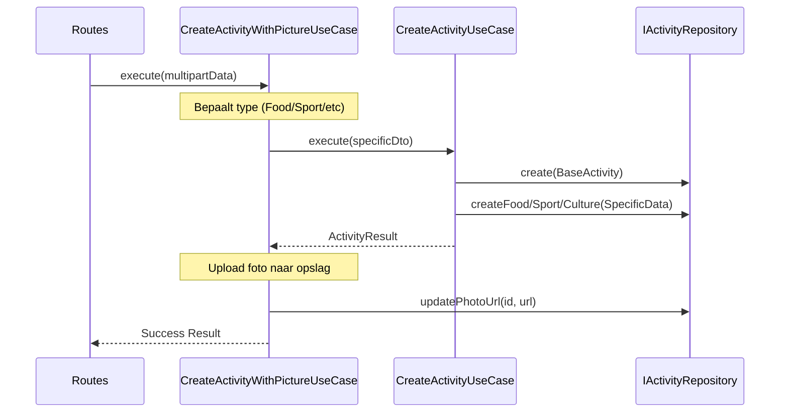

### Design Patterns UAE Applicatie

Dit document beschrijft de design patterns die zijn toegepast in de UAE (Ultimate Activity Experience) applicatie, specifiek gericht op de functionaliteit rondom het aanmaken van activiteiten.

---

### 1. Repository Pattern

#### Motivatie
Het Repository Pattern wordt gebruikt om de business logica (Use Cases) los te koppelen van de data-toegangslaag (Exposed ORM / Database). 

**Voordelen:**
- **Scheiding van belangen (Separation of Concerns):** De Use Case hoeft niet te weten hoe data precies wordt opgeslagen of opgehaald.
- **Vervangbaarheid:** We kunnen eenvoudig wisselen tussen een database-implementatie (`ActivityRepository`) en bijvoorbeeld een in-memory implementatie voor unit tests, zonder de Use Cases aan te passen.
- **Centrale logica:** Queries en data-mapping (`toActivity`) bevinden zich op één plek.

#### Klassendiagram

#### Sequence Diagram (Create Activity)

---

### 2. Strategy Pattern (Polymorfisme in DTOs & Use Cases)

#### Motivatie
Bij het aanmaken van activiteiten hebben we te maken met verschillende types (Food, Sport, Culture) die elk hun eigen specifieke data hebben. In plaats van één grote klasse met veel optionele velden, gebruiken we polymorfisme in de DTO's en een 'Strategy-achtige' aanpak in de Use Case.

**Voordelen:**
- **Type-veiligheid:** Specifieke velden zoals `Cuisine` horen alleen bij `FoodActivity`.
- **Uitbreidbaarheid:** Nieuwe activiteitstypes kunnen worden toegevoegd door een nieuwe DTO-klasse te maken zonder de basislogica te breken.
- **Schonere code:** De Use Case gebruikt een `when`-expressie om de specifieke opslaglogica te bepalen op basis van het type.

#### Klassendiagram

#### Sequence Diagram (Create with Picture & Type handling)

